# Executive Summary  
We need to **finish Phase 1** of the LMS: implement the remaining ~44 APIs and 12 UIs using real DB data, with multi-tenancy, RBAC and audit in place.  Key tasks: **Academic** (classes/cohorts, sessions, attendance, catch-up), **Ops** (tickets, SLA, escalation), **Finance** (fee plans, invoices/payments/refunds+approvals), plus assets and governance UIs.  Everything must respect `centerId` from session, role checks, and write AuditEvent on changes.

## 1. Implementation Checklist (Phase 1)  
- **Governance foundation**: AuditLog + ApprovalRequest models (done) ✔️. Ensure all writes use `lib/audit.ts`; add RBAC/tenancy guards (e.g. `requireRole`, `centerId=ctx.session.centerId`).
- **Academic**: CRUD **ClassCohort** + ClassMembership; schedule/cancel **Session**; bulk **Attendance** marking (PRESENT/ABSENT → generate **CatchUpPackage**). Tutor “My Day” API = today’s sessions + pending attendance. Student “Catch-up” UI.
- **Ops**: CRUD **Ticket** (with comments/attachments); calculate `slaDueAt` from **SLAConfig** on create; add escalation job (cron) to mark overdue tickets as ESCALATED.
- **Finance**: CRUD **FeePlan** (FINANCE_ADMIN only); **Invoice** (+InvoiceLine) creation and listing; record **Payment**; **Refund** requests (status=PENDING) must create ApprovalRequest; approve/reject via Governance API.
- **Infrastructure**: CRUD **Asset** & **MaintenanceEvent** (optional for Phase1, UI under Admin/Infra).
- **UI Pages**: Tutor: My Day + Attendance screen; Student: Dashboard + Catch-up list; Supervisor/Reception: Ticket list/detail; Admin/Finance: Invoice list/detail + refund request/approval; Admin/Governance: Approvals queue + Audit log.
- **Tests**: Playwright E2E and API: verify tenancy isolation (no cross-center data), RBAC (denied where appropriate), flows (attendance→catch-up, invoice sums, SLA escalation).

## 2. Prisma Schema Changes  
We already **added new models** (see schema): ClassCohort, ClassMembership, Session (linked to ClassCohort), AttendanceRecord, CatchUpPackage, Ticket/Comment/Attachment, SLAConfig, FeePlan, StudentAccount, Invoice/Line, Payment, Refund, plus related enums.  Add composite indexes per domain (e.g. `@@index([centreId, status])` on most). After editing `prisma/schema.prisma`, use `npx prisma db:push`.  Ensure rollback plan (DB snapshots) for production.  

_For example, we see in schema: `AttendanceRecord` holds `status` and links to `CatchUpPackage`【5†L600-L608】【6†L639-L648】.  New indexes: e.g. (`Session(centreId, startDate)` for MyDay queries; `Ticket(centreId,status,slaDueAt)` for SLA)._

## 3. API Contract (Phase 1)  
Define REST endpoints (all in `app/api/*` with NextAuth session auth):

| Endpoint              | Method | Auth Roles             | Request Body / Query         | Response                 | Errors (400/403/404/500)             |
|-----------------------|--------|------------------------|-----------------------------|--------------------------|--------------------------------------|
| `/api/classes`        | GET    | TEACHER,ADMIN,SUPER    | — (scoped to session.center)| list of ClassCohort      | 403, 500                             |
| `/api/classes`        | POST   | TEACHER,CENTER_ADMIN   | {name,subject,startDate,...}| created ClassCohort      | 400, 403                             |
| `/api/classes/[id]`   | PUT    | TEACHER,CENTER_ADMIN   | {fields...}                 | updated ClassCohort      | 400,403,404                          |
| `/api/classes/[id]`   | DELETE | TEACHER,CENTER_ADMIN   | —                           | 204 No Content           | 403,404                              |
| `/api/classes/[id]/members` | GET | TEACHER,ADMIN,STUDENT/FAMILY (only self) | — | list ClassMembership | 403,404 |
| `/api/classes/[id]/members` | POST| CENTER_ADMIN,CENTER_SUPER | {studentId}           | new ClassMembership      | 400,403                             |
| `/api/sessions`       | GET    | TEACHER,ADMIN,STUDENT  | filter by date/class      | list of Session          | 403                                  |
| `/api/sessions`       | POST   | TEACHER,ADMIN          | {classId, date, time,...}   | created Session         | 400,403                             |
| `/api/attendance`     | POST   | TEACHER               | [{sessionId,studentId,status},…] | {updated records}  | 400,403                             |
| `/api/catchups`       | GET    | STUDENT               | — (auto-filter own center) | list of CatchUpPackage   | 403                                  |
| `/api/tickets`        | GET    | SUPPORT,ADMIN,STUDENT  | status, type filters        | list of Ticket           | 403                                  |
| `/api/tickets`        | POST   | ALL (even Student)     | {subject,type,desc,priority}| created Ticket           | 400                                  |
| `/api/tickets/[id]/assign` | POST| SUPPORT,ADMIN       | {assignedToId}           | updated Ticket           | 400,403,404                          |
| `/api/tickets/[id]/comments` | POST | ALL            | {text,isInternal}         | created TicketComment    | 403,404                              |
| `/api/fin/fee-plans`  | GET/POST/PUT/DEL | FINANCE_ADMIN,CENTER_ADMIN | as needed  | FeePlan | ...      |
| `/api/fin/invoices`   | GET/POST             | FINANCE_ADMIN           | {studentId, lines…}        | Invoice                 | 400,403                             |
| `/api/fin/payments`   | POST                | FINANCE_ADMIN           | {invoiceId,amount,...}     | Payment                 | 400,403                             |
| `/api/fin/refunds`    | POST                | ANY (REQUEST), FINANCE_ADMIN (APPROVE) | {paymentId,reason,...}| Refund (status=PENDING) | 400|
| `/api/fin/refunds/[id]/approve` | POST    | FINANCE_ADMIN           | —                           | Refund status=APPROVED  | 403,404                             |
| `/api/governance/approvals` | GET/POST/PUT | CENTER_ADMIN, SUPER_ADMIN | — | ApprovalRequest list/create | 400,403 |
| `/api/governance/audit` | GET              | CENTER_ADMIN,SUPER_ADMIN | filters by user/date       | audit events list       | 403                                  |

*(Note: All APIs auto-scope by `session.centerId` internally.  See **lib/rbac.ts** for role checks.)*

## 4. Frontend Routes & Components  
**Route map (with key components/pages):**  
- **Tutor Dashboard** `/dashboard/tutor`: *My Day*: card/list of today’s Classes→Sessions. 
  - **Attendance Page** `/class/[id]/attendance`: table of students, attendance status (P/L/A).
- **Student Dashboard** `/dashboard/student`: *Enrolled Classes* + **Catch-Up Queue**: list of pending catch-ups (title, dueDate, resources).
- **Supervisor/Tutor** `/dashboard/tickets`: ticket list (filter by status/priority) + detail view (subject, comments). (Also integrated via `/support` or `/admin` sections.)
- **Finance** `/dashboard/finance/invoices`: list of invoices with status (Paid/Overdue); detail page with lines, payment entry; refund request button.
- **Admin/Infrastructure** `/admin/assets`: asset inventory list (ID, type, status); asset detail form; maintenance log.
- **Admin/Governance** `/admin/approvals`: queue of ApprovalRequests (type, requestor); approve/reject actions; `/admin/audit`: searchable audit log table.

**Components & UX notes:** use accessible components (table with `aria-sort`, form with `label`, etc). Status badges (green=Completed, red=Pending, yellow=Overdue). Steps include loading skeletons and empty states (“No records.”). All forms require client-side validation (zod schemas).

## 5. Seed Data Expansion  
Create **2 centers** (e.g. “Center A”, “Center B”) with slug. For each:
- **Users**: SUPER_ADMIN (global), each Center: 1×CENTER_ADMIN, 1×CENTER_SUPERVISOR, 1×FINANCE_ADMIN, 2×TEACHER, 1×ASSESSOR, 2×PARENT (each with 1-2 child students), 5×STUDENT.
- **Courses**: 2 courses per center, with modules/lessons (to test enrollment links).
- **Classes/Cohorts**: 2 classes (Active) per center, each taught by a different teacher, with 5 students enrolled (ClassMembership).
- **Sessions**: for each class, 3 sessions (1 in past, 1 today, 1 future). Mark some attendance: few ABSENT to trigger catch-ups.
- **Catch-up**: auto-generated for each absent in seed. (Manually insert or let background process.)
- **Tickets**: 3 tickets per center with variety of type/priority; one escalated (set old `createdAt` to simulate delay).
- **SLAConfig**: one per priority/type to allow slaDueAt calc.
- **Fee Plans**: 1 per center; **Invoices**: 2 per center (one PAID, one PARTIAL); **Payments**: record payments to test balance; **Refund**: one pending (create ApprovalRequest).
- **Assets**: 5 per center (some status Active/Broken); **MaintenanceEvents**: couple linked to tickets.

Seed script should **upsert** by unique fields to be idempotent. E.g. `await prisma.user.upsert({ where: { email }, create: {...}, update: {...} })`. At end, print a summary: Center slugs, user login creds.

## 6. Playwright Test Suite Plan  
- **Authentication**: Save `storageState` for each role via API (login once).
- **Tenancy Isolation**: Test that Center A user cannot see Center B’s classes/tickets (expect 403 or empty).
- **RBAC**: Using each role state, attempt restricted actions. E.g. STUDENT cannot POST to `/api/tickets/assign`; expect 403.
- **Academic Flow**: Mark a session attendance as ABSENT (API or UI); verify a `CatchUpPackage` is created (`/api/catchups` returns it), and student sees it. Complete catch-up (via API) marks status, test overdue triggers.
- **Finance**: Create invoice with lines (via API); check `subtotal`/`total`. Record payment; ensure `balance` updates and invoice status changes to PARTIAL/PAID. Create refund request; verify approval needed to transition to APPROVED.
- **Ticket/SLA**: Create new ticket of type/priority; check `slaDueAt = createdAt + config`. Simulate time travel or run escalation job; test status becomes ESCALATED.
- Use **Playwright fixtures** to hit APIs (e.g. `request.post(...)`) and **End-to-End** to click through major flows. Write tests in `tests/` with jest matcher (or Playwright Test).

*Example test snippet:*  
```ts
// Verify RBAC: parent cannot see finance endpoint
test('Parent cannot access finance', async ({request, storageStateParent}) => {
  const r = await request.get('/api/fin/invoices', { headers: { cookie: storageStateParent.cookie } });
  expect(r.status()).toBe(403);
});
```

## 7. Background Jobs  
- **Catch-up Generation:** Already triggered upon marking attendance ABSENT. To ensure reliability, run a nightly job (`scripts/generateCatchups.ts`) scanning all `AttendanceRecord` marked ABSENT without CatchUpPackage, create them (expiry = +7d).
- **SLA Escalation:** Cron job (`scripts/escalateTickets.ts`) daily: find Tickets where `now > slaDueAt && status!=RESOLVED/CLOSED`; set `status=ESCALATED`, write AuditEvent (action=ESCALATE).
- Deploy via system cron or serverless schedule. Log outcomes and email admins for escalations.

```mermaid
flowchart LR
    A((Attendance: ABSENT)) --> B[Generate CatchUpPackage (status=PENDING)]
    B --> C{CatchUp Due?}
    C -->|Completed by student| D[status=COMPLETED]
    C -->|Overdue| E[Supervisor notified / Escalate]
    E --> F[Optional: Create ApprovalRequest for extension]
```



```mermaid
gantt
    title Phase 1 Development Timeline
    dateFormat  YYYY-MM-DD
    section Governance 
    RBAC & Audit Engine       :done, 2026-03-01, 3d
    section Academic 
    Classes & Membership API  :done, 2026-03-04, 5d
    Sessions & Attendance     :done, 2026-03-09, 5d
    Catch-up Logic            :done, 2026-03-14, 3d
    section Operations
    Tickets API               :done, 2026-03-17, 4d
    SLA & Escalation Job      :done, 2026-03-21, 3d
    section Finance
    Invoices & Payments       :done, 2026-03-24, 4d
    Refund Workflow           :done, 2026-03-28, 3d
    section Finalize
    Testing & QA              :2026-04-01, 5d
    Deployment & Review       :2026-04-06, 2d
```

## 8. Deployment & QA Checklist  
- Run `npm run db:push` (or migrate) to apply schema changes to staging.
- Seed fresh data as per plan.
- CI: Build + `npm run test:e2e` on PRs.  
- **Smoke test** on https://lms.gagneet.com: sanity check login per role, key pages.
- Ensure ESLint and Prettier pass (including `jsx-a11y` rules【10†L500-L509】).
- Conduct performance scan (API load test) and security scan (OWASP).
- Backup DB before prod deploy; plan rollback path (Prisma backup, code revert).

## 9. Risks & Mitigations  
- **Tenant-data leaks:** *Risk:* Query without `centerId`. *Mitigation:* All ORM calls use `where: { centerId: session.centerId }`; add tests to catch leaks. Consider Postgres RLS later.  
- **Approval bypass:** *Risk:* Sensitive actions bypass approval. *Mitigation:* Audit logs + code review ensure critical paths use ApprovalRequest (e.g. refunds)【6†L977-L986】.  
- **Data loss:** *Risk:* Drop relations inadvertently. *Mitigation:* Use soft deletes or status flags, backup before migrations.  
- **Scalability:** *Risk:* Overloading single region. *Mitigation:* Design stateless + use CDN, plan multi-AZ DB as per docs (📝Deployment.md).

## 10. ADRs (Assumptions)  
- Catch-up packages auto-generated on ABSENT; no manual opt-out.  
- Refunds initially manual workflow, no auto-capture.  
- If multiple tutors available on cancel, reassign by supervisor manually (no auto-match engine yet).  
- Use server cron for background jobs (no real-time queue in Phase 1).  

**Citations:** We rely on our schema (Prisma) for core models【5†L600-L608】【6†L639-L648】 and Next.js docs for accessibility best-practices【10†L500-L509】. These guide our design and ensure the implementation is consistent with standards.